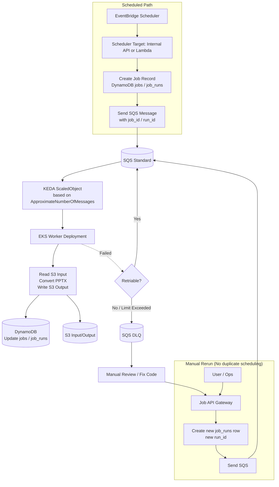
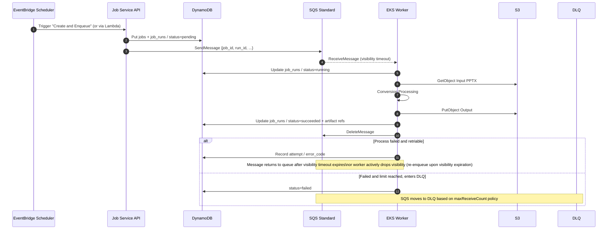
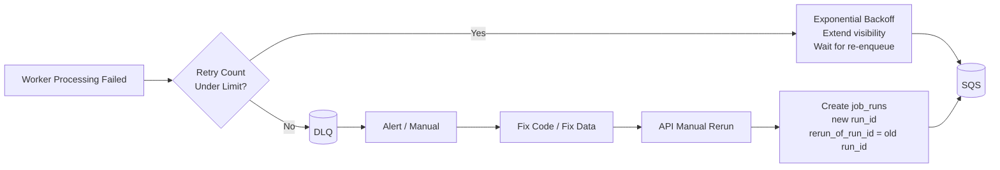
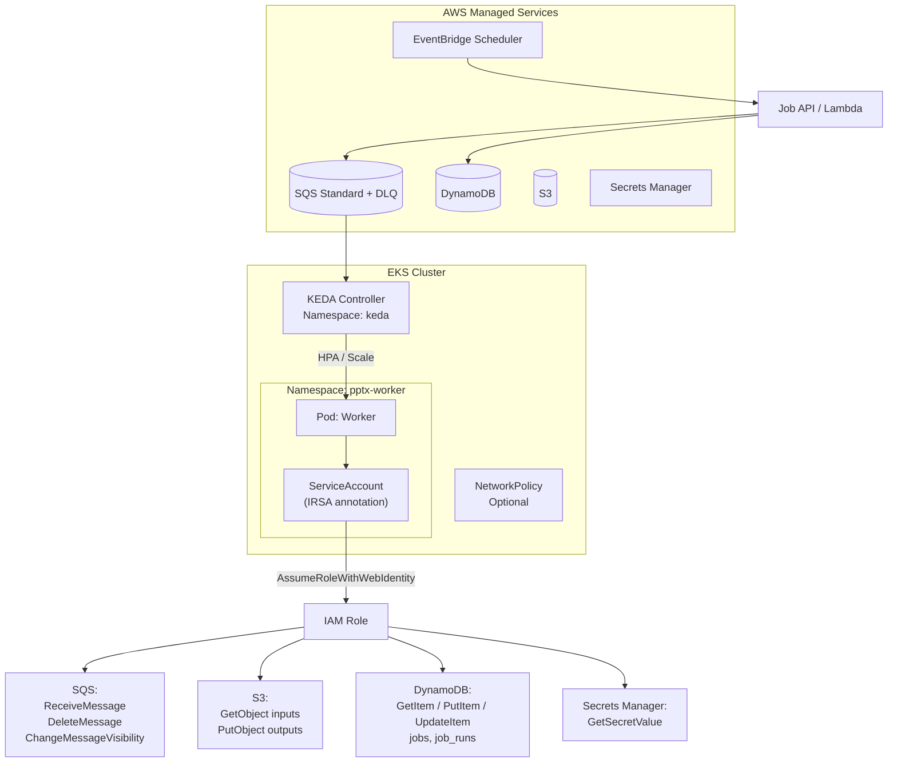
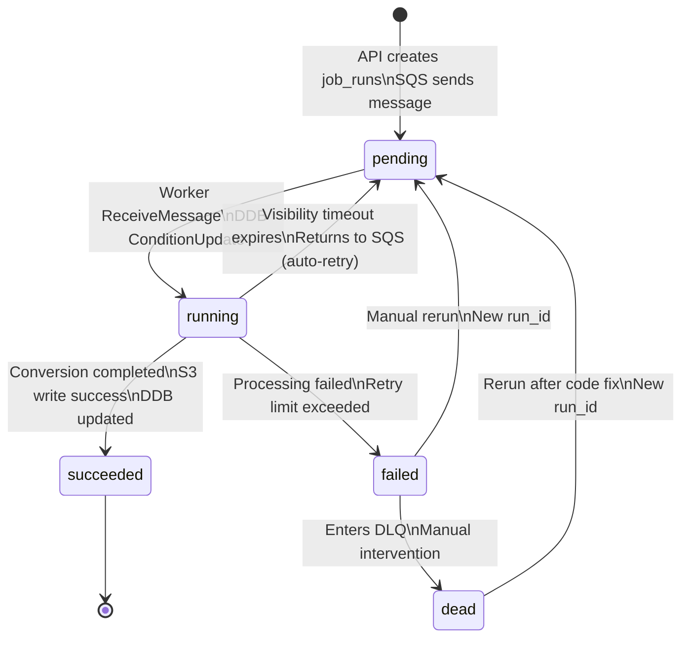

# Technical Diagrams — PPTX Worker Queue on AWS EKS

## 1. Overview: Scheduled Path vs Manual Rerun

---

## 2. Sequence Diagram: Single Run (Includes Visibility and State)

---

## 3. Failure, Retry, DLQ, Rerun after Code Fix

**Semantics Note:** rerun = new `run_id`; old run is kept in `job_runs` for auditing;  
Schedules are not re-triggered by reruns; new runs are only created via API.

---

## 4. Deployment and Identity (IRSA)

---

## 5. Job State Machine

